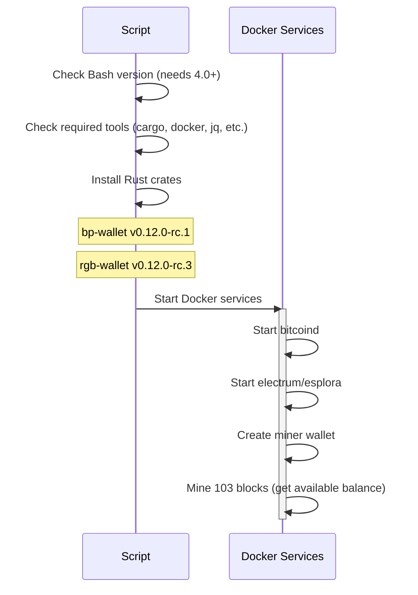
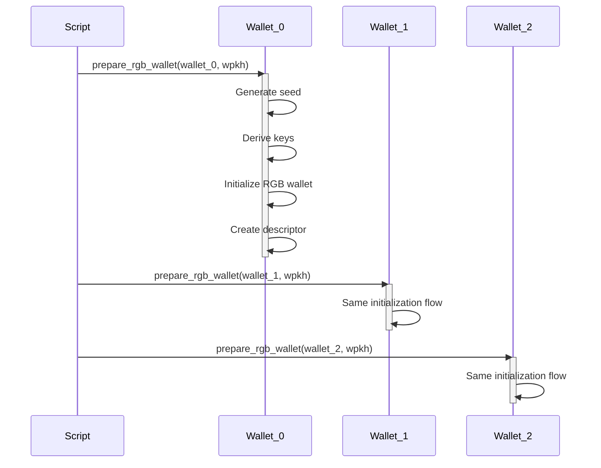
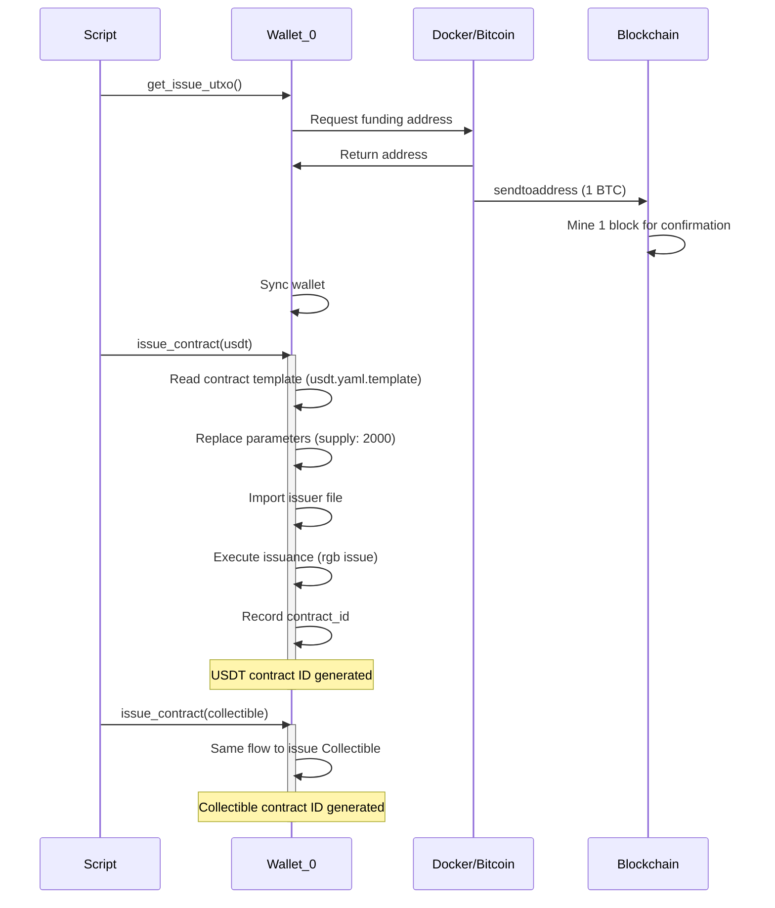
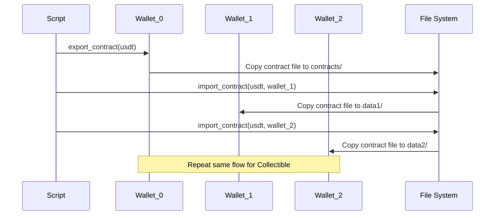
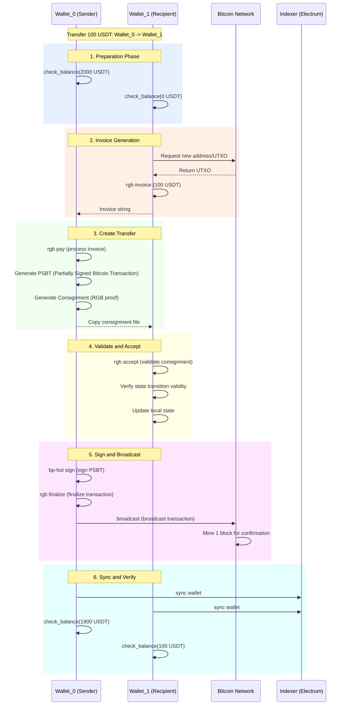
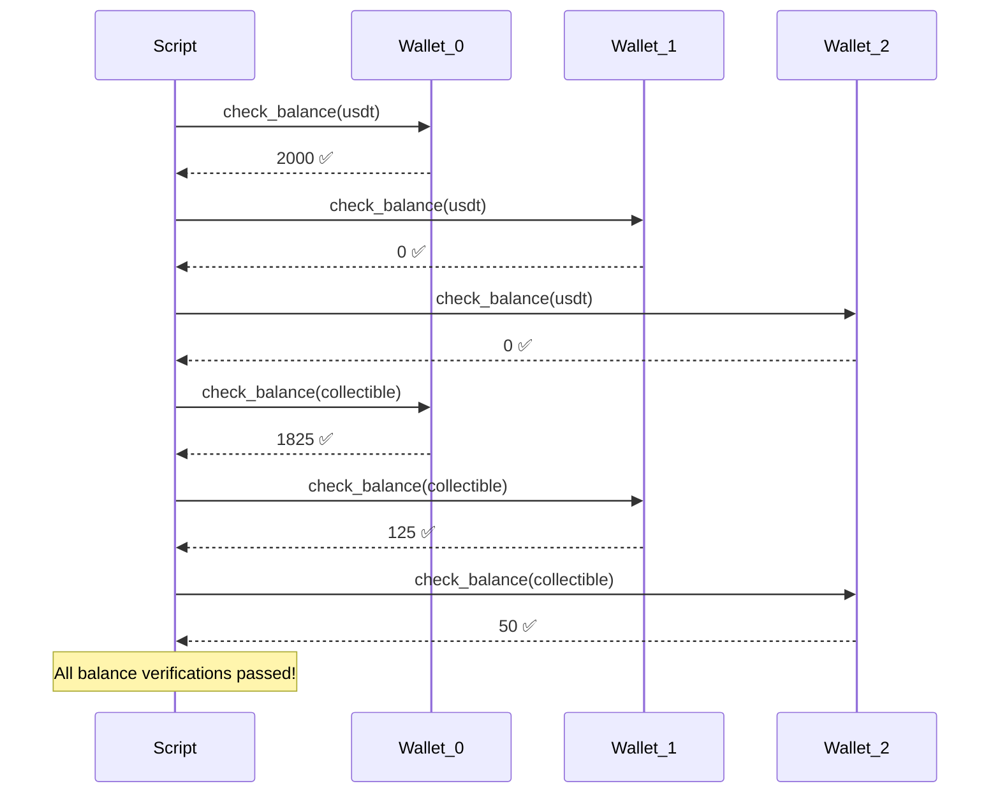
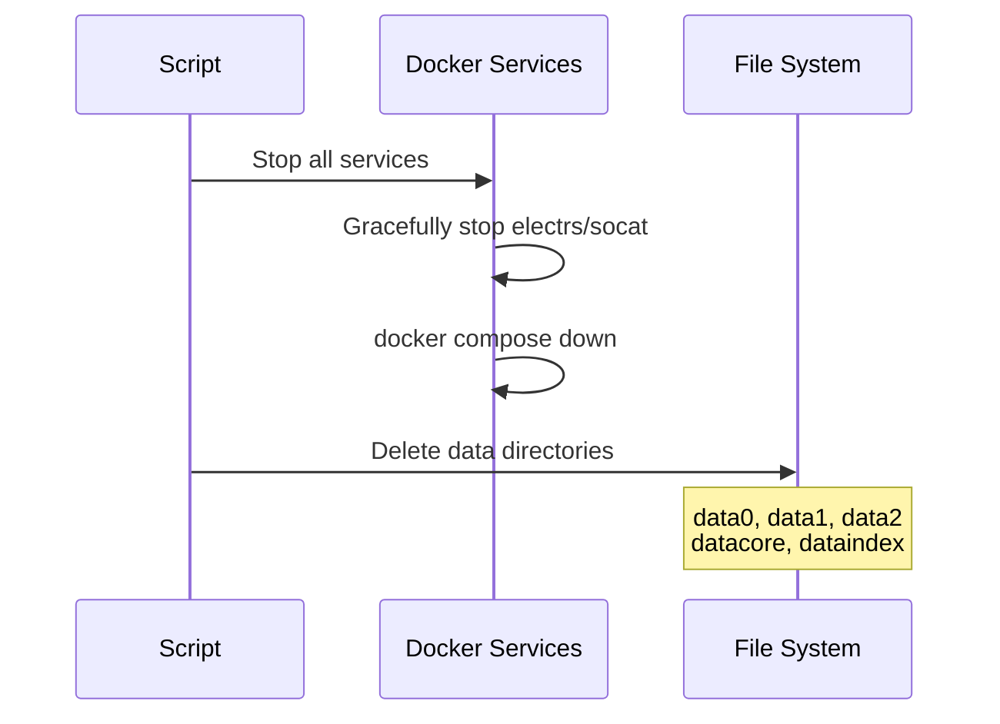

# RGB Demo.sh Execution Analysis Report

## 📋 Table of Contents
1. [Script Overview](#script-overview)
2. [Core Components](#core-components)
3. [Execution Flow Details](#execution-flow-details)
4. [Sequence Diagrams](#sequence-diagrams)
5. [Scenario Descriptions](#scenario-descriptions)
6. [Key Function Analysis](#key-function-analysis)

---

## Script Overview

`demo.sh` is a complete RGB protocol testing sandbox script that demonstrates the issuance and transfer flow of RGB smart contracts on the Bitcoin network.

### Main Features
- 🏦 Issue two types of RGB assets: USDT (RGB20) and Collectible (RGB25)
- 💸 Perform multiple asset transfers between three wallets
- ✅ Verify the correctness of all transfers
- 🔄 Support two wallet types: wpkh and tapret-key-only

### Technology Stack
- **Language**: Bash 4.0+
- **Blockchain**: Bitcoin Regtest
- **Wallets**: bp-wallet, rgb-wallet
- **Indexer**: Electrum (default) / Esplora
- **Containers**: Docker Compose

---

## Core Components

### 1. Variable Configuration
```
CONTRACT_DIR="contracts"          # Contract files directory
NETWORK="regtest"                 # Bitcoin test network
WALLET_PATH="wallets"             # Wallet path
SATS=800                          # Satoshis per transfer
FEE=260                           # Transaction fee
```

### 2. RGB Wallet Types
- **wpkh**: Traditional SegWit wallet (BIP84)
- **tapret-key-only**: Taproot wallet (BIP86)

### 3. Indexer Configuration
- **Electrum**: Port 50001
- **Esplora**: HTTP API on port 8094

### 4. Contract Mapping
```
CONTRACT_NAME_MAP["usdt"] = USDT
CONTRACT_NAME_MAP["collectible"] = OtherToken
```

---

## Execution Flow Details

### Phase 1: Initial Setup



**Key Steps**:
1. ✅ `check_tools()`: Verify all dependency tools
2. 🔧 `install_rust_crate()`: Install bp-wallet and rgb-wallet
3. 🐳 `start_services()`: Start Docker containers
4. ⛏️ `prepare_btc_wallet()`: Mine to get initial funds

---

### Phase 2: Wallet Preparation



**Each wallet initialization includes**:
1. 📝 Create seed file (`bp-hot seed`)
2. 🔑 Derive key pairs (`bp-hot derive`)
3. 🎨 Initialize RGB storage (`rgb init`)
4. 💼 Create wallet instance (`rgb create`)

---

### Phase 3: Contract Issuance



**Contract Parameters**:
- **Supply**: 2000 units
- **Binding**: Specific UTXO (txid:vout)
- **Types**: NIA (RGB20) and CFA (RGB25)

---

### Phase 4: Contract Distribution



**Notes**:
- RGB contracts are shared via file system
- Each wallet needs to import the contract definition to receive that asset

---

### Phase 5: Asset Transfers

This is the most complex part. Let me show a complete transfer flow in detail:



#### Transfer Type Descriptions

**Transfers included in Scenario 0 (default)**:

| # | Asset | Sender | Recipient | Amount | Type | Description |
|---|-------|--------|-----------|--------|------|-------------|
| 0 | USDT | wallet_0 | wallet_1 | 100 | Aborted | Aborted transfer |
| 1 | USDT | wallet_0 | wallet_1 | 100 | Normal | Retry success |
| 2 | Collectible | wallet_0 | wallet_1 | 200 | Normal | CFA asset |
| 3 | USDT | wallet_0 | wallet_1 | 200 | Witness | Using witness output |
| 4 | USDT | wallet_1 | wallet_2 | 250 | Normal | Spend multiple allocations |
| 5 | Collectible | wallet_1 | wallet_2 | 100 | Normal | CFA asset |
| 6 | USDT | wallet_2 | wallet_0 | 100 | Witness | Close loop, return to issuer |
| 7 | Collectible | wallet_2 | wallet_0 | 50 | Witness | CFA close loop |
| 8 | USDT | wallet_0 | wallet_1 | 50 | Normal | Spend returned assets |
| 9 | Collectible | wallet_0 | wallet_1 | 25 | Normal | CFA re-transfer |
| 10 | USDT | wallet_1 | wallet_2 | 100 | Normal | Spend all (no change) |
| 11 | USDT | wallet_2 | wallet_0 | 250 | Witness | Return all |

---

### Phase 6: Final Verification



---

### Phase 7: Cleanup



---

## Scenario Descriptions

The script supports 4 predefined scenarios:

### scenario_0 (default)
- **Wallet Type**: wpkh (SegWit)
- **Includes**: Aborted transfer test
- **Number of Transfers**: 12
- **Test Points**:
  - ✅ Normal transfers
  - ✅ Aborted/retry transfers
  - ✅ Witness output transfers
  - ✅ Spend multiple allocations
  - ✅ No-change transfers

### scenario_1
- **Wallet Type**: tapret-key-only (Taproot)
- **Other**: Same as scenario_0

### scenario_10
- **Wallet Type**: wpkh
- **Excludes**: Aborted transfer test
- **Number of Transfers**: 11

### scenario_11
- **Wallet Type**: tapret-key-only
- **Excludes**: Aborted transfer test
- **Number of Transfers**: 11

---

## Key Function Analysis

### 1. transfer_assets()
The most important function that handles the complete asset transfer flow.

**Parameters**:
```bash
transfer_assets wallet_0/wallet_1 2000/0 100 1900/100 0 0 usdt
                ↑                  ↑       ↑   ↑         ↑ ↑ ↑
                sender/recipient   initial  amt final    wit reuse contract
```

**Internal Flow**:
1. `transfer_create()`: Create transfer (generate PSBT and consignment)
2. `transfer_complete()`: Complete transfer (validate, sign, broadcast)

### 2. prepare_rgb_wallet()
Initialize RGB wallet.

**Steps**:
1. Generate BIP39 seed
2. Derive HD keys (BIP84 or BIP86)
3. Create RGB wallet
4. Set descriptor mapping

### 3. issue_contract()
Issue RGB contract.

**Steps**:
1. Read YAML template
2. Replace parameters (supply, UTXO)
3. Import issuer file
4. Execute issue command
5. Record contract_id

### 4. check_balance()
Verify wallet balance.

**Verification Logic**:
1. List all unspent outputs (UTXOs)
2. Get RGB allocations for each UTXO
3. Sum up total balance
4. Compare with expected value

---

## Execution Time Estimation

| Phase | Time | Notes |
|-------|------|-------|
| Initial Setup | ~30-60s | First run requires Rust compilation |
| Wallet Preparation | ~10s × 3 | Per wallet |
| Contract Issuance | ~5s × 2 | Per contract |
| Single Transfer | ~10-15s | Including mining and sync |
| **Total** | **~5-10 minutes** | Full run of scenario_0 |

---

## Data Flow Diagram

```
┌──────────────────────────────────────────────────────────────────┐
│                     demo.sh Execution Flow                        │
└──────────────────────────────────────────────────────────────────┘
                                 │
                                 ▼
         ┌───────────────────────────────────────┐
         │  1. Environment Check and Init         │
         │  - Bash version ≥ 4.0                  │
         │  - Tool dependencies (cargo, docker...)│
         └───────────────────────────────────────┘
                                 │
                                 ▼
         ┌───────────────────────────────────────┐
         │  2. Install Rust Crates                │
         │  - bp-wallet v0.12.0-rc.1              │
         │  - rgb-wallet v0.12.0-rc.3             │
         └───────────────────────────────────────┘
                                 │
                                 ▼
         ┌───────────────────────────────────────┐
         │  3. Start Docker Services              │
         │  ┌─────────────────────────────────┐  │
         │  │ bitcoind (regtest)              │  │
         │  │ electrum / esplora              │  │
         │  └─────────────────────────────────┘  │
         └───────────────────────────────────────┘
                                 │
                                 ▼
         ┌───────────────────────────────────────┐
         │  4. Prepare Bitcoin Wallet             │
         │  - Create miner wallet                 │
         │  - Mine 103 blocks (get funds)         │
         └───────────────────────────────────────┘
                                 │
                                 ▼
         ┌───────────────────────────────────────┐
         │  5. Prepare RGB Wallets (0/1/2)        │
         │  ┌─────────────────────────────────┐  │
         │  │ Generate seed                   │  │
         │  │ Derive keys (BIP84/BIP86)       │  │
         │  │ Initialize RGB storage          │  │
         │  │ Create wallet instance          │  │
         │  └─────────────────────────────────┘  │
         └───────────────────────────────────────┘
                                 │
                                 ▼
         ┌───────────────────────────────────────┐
         │  6. Issue RGB Contracts                │
         │  ┌─────────────────────────────────┐  │
         │  │ USDT (RGB20): 2000 units        │  │
         │  │ Collectible (RGB25): 2000 units │  │
         │  └─────────────────────────────────┘  │
         └───────────────────────────────────────┘
                                 │
                                 ▼
         ┌───────────────────────────────────────┐
         │  7. Export/Import Contracts            │
         │  wallet_0 ──export──> contracts/       │
         │  contracts/ ──import──> wallet_1/2     │
         └───────────────────────────────────────┘
                                 │
                                 ▼
         ┌───────────────────────────────────────┐
         │  8. Asset Transfer Loop (multiple)     │
         │  ┌─────────────────────────────────┐  │
         │  │ Recipient generates invoice     │  │
         │  │ Sender creates transfer (PSBT)  │  │
         │  │ Recipient validates consignment │  │
         │  │ Sender signs and broadcasts     │  │
         │  │ Mine for confirmation           │  │
         │  │ Both parties sync wallets       │  │
         │  │ Verify balances                 │  │
         │  └─────────────────────────────────┘  │
         └───────────────────────────────────────┘
                                 │
                                 ▼
         ┌───────────────────────────────────────┐
         │  9. Final Balance Verification         │
         │  ✅ wallet_0: 2000 USDT, 1825 CFA      │
         │  ✅ wallet_1: 0 USDT, 125 CFA          │
         │  ✅ wallet_2: 0 USDT, 50 CFA           │
         └───────────────────────────────────────┘
                                 │
                                 ▼
         ┌───────────────────────────────────────┐
         │  10. Cleanup                           │
         │  - Stop Docker services                │
         │  - Delete data directories             │
         └───────────────────────────────────────┘
```

---

## Technical Highlights

### RGB Protocol Key Concepts

1. **Client-side Validation**: RGB state is validated off-chain
2. **Consignment**: Data package containing state transition proofs
3. **PSBT**: Partially Signed Bitcoin Transaction
4. **Seal**: Mechanism to bind RGB state to UTXO

### Two Commitment Methods

1. **OP_RETURN (opret)**: Uses OP_RETURN output
2. **Tapret**: Uses Taproot output (more private)

### Transfer Modes

1. **Blinded UTXO**: Recipient provides specific UTXO
2. **Witness Output (wout)**: Sender creates new witness output

---

## Troubleshooting

### 1. Bash Version Error
```bash
ERROR: This script requires Bash 4.0 or higher
```
**Solution**: Install newer bash on macOS
```bash
brew install bash
/opt/homebrew/bin/bash demo.sh
```

### 2. Docker Port Conflict
```bash
ERROR: port 50001 is already bound
```
**Solution**: Stop services occupying the port
```bash
./demo.sh --stop
```

### 3. Missing Tools
```bash
ERROR: could not find required tool "jq"
```
**Solution**: Install missing tools
```bash
brew install jq
```

---

## Command Line Arguments

```bash
./demo.sh [options]

Options:
  -h, --help          Display help information
  -l, --list          List available scenarios
  -s, --scenario <N>  Run specified scenario (default: 0)
  -v, --verbose       Enable verbose output
  -r, --recompile     Force recompile
      --esplora       Use esplora indexer (default: electrum)
  -u, --skip-stop     Don't stop Docker containers after completion
      --stop          Stop Docker containers
```

### Usage Examples

```bash
# Run default scenario (wpkh, includes abort test)
./demo.sh

# Run Taproot scenario
./demo.sh -s 1

# Use Esplora indexer
./demo.sh --esplora

# Verbose mode + don't stop services
./demo.sh -v -u

# List all scenarios
./demo.sh -l
```

---

## Summary

`demo.sh` is a comprehensive RGB protocol testing script that demonstrates:

✅ **Complete Lifecycle**: From wallet creation to asset issuance, to multiple transfers
✅ **Multiple Scenarios**: Support different wallet types and transfer modes
✅ **Strict Validation**: Balance and state checks at every step
✅ **Automation**: One-click run for the entire test flow
✅ **Cleanup Mechanism**: Automatically clean up environment and data

This is an excellent starting point for learning and testing the RGB protocol!

---

## Appendix: Key File Structure

```
rgb-sandbox/
├── demo.sh                          # Main script
├── contracts/                        # Contract files directory
│   ├── usdt.yaml.template           # USDT contract template
│   └── collectible.yaml.template    # Collectible contract template
├── issuers/                         # Issuer definitions
│   ├── RGB20-Simplest-v0-*.issuer
│   └── RGB25-UniquelyFungible-v0-*.issuer
├── wallets/                         # Wallet files
│   ├── wallet_*.seed                # Seed files
│   └── wallet_*.derive              # Derived keys
├── data0/                           # wallet_0's RGB data
├── data1/                           # wallet_1's RGB data
├── data2/                           # wallet_2's RGB data
├── bp-wallet/                       # bp-wallet binaries
│   └── bin/
│       ├── bp
│       └── bp-hot
└── rgb-wallet/                      # rgb-wallet binaries
    └── bin/
        └── rgb
```

---

**Generated**: 2026-02-03
**Script Version**: demo.sh (RGB v0.12)
